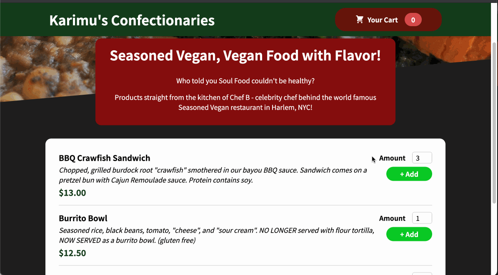
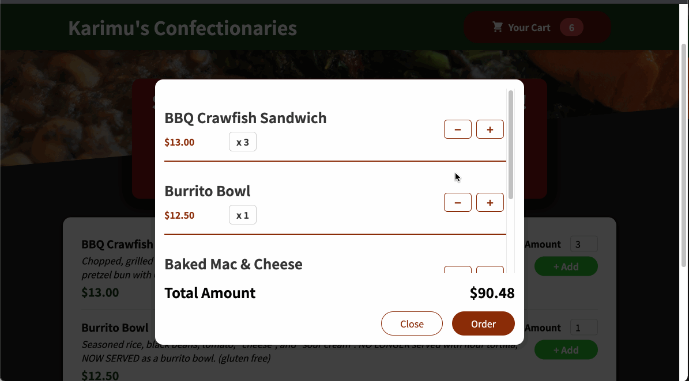

# Karimu Store Menu

## Project Summary
A React based project to mock up a food delivery web application. E-commerce is a cornerstone of web technologies and a food site mock up offered a lot of practice with key concepts. Besides for advanced state mechanics, this projects illustrate both a realistic menu module as well as an interactive cart module.

## Menu Module Behavior:

## Cart Module Behavior:

## Weblink:
[Heroku Link](https://confectionaries.herokuapp.com/)

